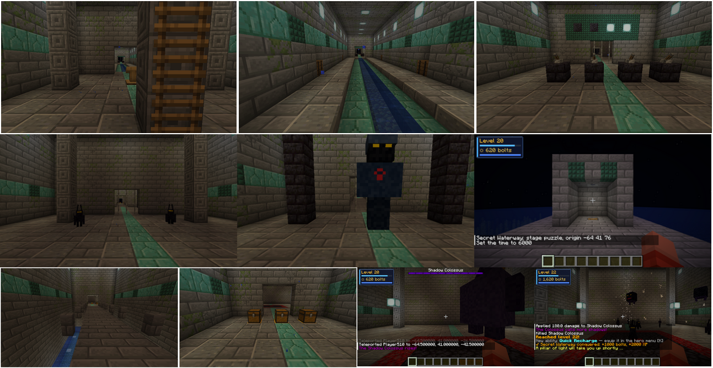

# Dungeons

made by SANTIQ · Stand 2026-10-03 · AAA-Vorgabe „Dungeon System“

## 1. Geheime Wasserstraße (Traverse Town)

Unter Traverse Town, nördlich der Stadt (24 Blöcke tief). Eingang: Kanalhäuschen mit Leiterschacht. Gebaut wird
einmal pro Welt beim ersten Besuch der Stadt (bestehende Welten bekommen ihn beim nächsten Besuch). Stil wie die
Wasserstraße in Kingdom Hearts: Steinziegel mit Moos und Rissen, Prismarin-Mosaik, Seelaternen, Wasserkanal.

| # | Abschnitt (AAA) | Raum | Inhalt |
|---|---|---|---|
| 1 | Eingang | Eingangshalle | Leiter, Säulen, Lesepult; Raumname in der Aktionsleiste |
| 2 | Erkundung | Kanal | Wasserlauf, Seitennischen mit Fässern (Bolts) |
| 3 | Rätsel | Raum der Lichter | 4 Hebel; das Wandbild über dem Gitter zeigt, welche an sein müssen (Seelaterne = an). Neues Muster je Runde |
| 4 | Kampf | Arena der Schatten | Gitter fallen beim Betreten; 3 Wellen (Schatten → Soldaten + Luftsoldaten → Large Body + Schatten) |
| 5 | Geheimnis | Geheimkammer | rissige Wand mit Leuchtflechte in der Ostwand der Arena; Truhe mit reicher Beute (Orichalcum, Raritanium, evtl. DNA) |
| 6 | Miniboss | Halle des Torwächters | Torwächter: Soldat, 1,9-fach groß, 8-fache Lebenspunkte, Bossleiste |
| 7 | Neuer Bereich | Schacht der Tiefe | 3 breite Brücke über 8 Blöcke tiefem Schacht (Wasser unten, Leiter zurück) |
| 8 | Schatz | Schatzkammer | 3 Truhen auf Gold (Mitte reich) |
| 9 | Boss | Thronsaal der Finsternis | Schattenkoloss: Large Body, 2,6-fach groß, 9-fache Lebenspunkte, 1,8-facher Schaden; bei 66 % und 33 % Beschwörung (Schatten, Phase 2 auch Darkballs); Gitter hinter euch |

**Sieg:** +1000 Bolts und +2000 Helden-EP für alle, die in dieser Runde im Dungeon waren; beschworene Schatten
vergehen; Lichtsäule, nach 10 s zurück zum Eingang. **Zurücksetzen** nach 20 min (wenn niemand drin ist), beim
Serverstart und mit `/hero dungeon reset`: Gitter zu, Hebel aus, neues Muster, Geheimwand neu, Fässer/Truhen neu,
übrige Dungeon-Gegner entfernt.

Befehle (OP): `/hero dungeon tp` (zum Eingang), `/hero dungeon status`, `/hero dungeon reset`.
Code: `dungeon/WaterwayLayout` (Grundriss, getestet in `WaterwayLayoutTest`), `WaterwayBuilder` (Bau),
`WaterwayDungeon` (Ablauf, Zustand).

**Im Spiel geprüft (komplett durchgespielt, zweimal):** Bau an der Oberfläche und unten; Rätsel nach Wandbild →
„Die Lichter stimmen“; Arena verriegelt, 3 Wellen, frei; Torwächter erscheint, fällt; Brücke, Schatzkammer;
Koloss erscheint, zwei Beschwörungs-Phasen, Sieg mit Belohnung, Rückkehr an die Oberfläche (Y 65 vor dem Häuschen);
Geheimkammer-Truhe gefüllt, rissige Wand vorhanden; Zurücksetzen (Gitter zu, Hebel aus, Abschnitt „Rätsel“).
Gegner im Test per Befehl besiegt (`/kill`, `/damage`), nicht im echten Kampf.
**Gefunden und behoben:** beschworene Schatten blieben nach dem Bosssieg stehen.
**Nicht geprüft:** Mehrspieler im Dungeon, echte Kampfbalance (Schaden/Lebenspunkte von Torwächter und Koloss),
20-min-Zurücksetzen durch Zeitablauf (nur per Befehl und Serverstart).

