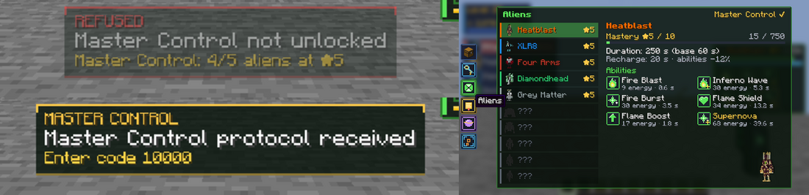
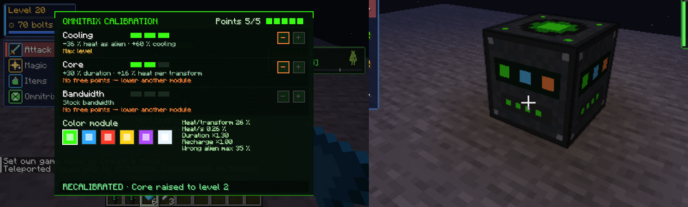
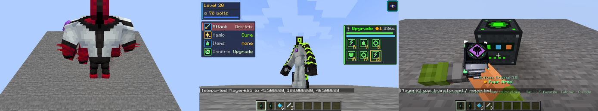
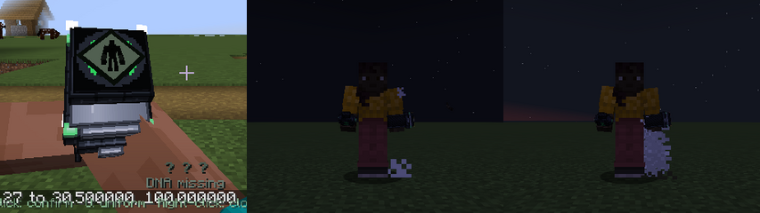

# OMNITRIX CORE — Bestand, Architektur, Fahrplan

made by SANTIQ · Stand 2026-10-02 · Vorgabe: „OMNITRIX FIRST. EVERYTHING ELSE SECOND.“

## 1. Bestandsaufnahme vor dem Umbau

| Bereich | Stand | Bewertung |
|---|---|---|
| Alien-Definitionen (DNA) | `AlienDefinition` als synchronisierte Datenpaket-Registry (`data/.../alien/*.json`): Dauer, Nachladen, Energie, Groesse, Attribute, Immunitaeten, Faehigkeiten, DNA-Quellen, Modell | **funktioniert**, datengetrieben |
| Faehigkeiten | `AbilityRegistry` + Slots je Alien, Energie/Abklingzeit pro Slot | **funktioniert**, modular |
| Verwandlung (Server) | `TransformationManager` + `TransformationState` (synchronisiert): verwandeln, zurueck, Ablauf, Attribute, Warnpiepen | funktioniert, aber **Geraet hatte keinen eigenen Zustand** |
| Bedien-Ablauf (Client) | `OmnitrixController` mit `OmnitrixPhase` (13 Phasen: heben, oeffnen, Rad, bestaetigen, Schlag …), Feder-Rad, Sync an andere | funktioniert, Zeiten **hart codiert** |
| Modell/Rendering | 3D-Geraet am Arm (Ego + Third-Person), Kern faehrt aus, Zifferblatt-Silhouette, Hologramm | funktioniert; Licht **immer gruen** (nur Abklingzeit gedimmt) |
| Freischaltung | DNA-Proben → `HeroData.unlockedAliens` | funktioniert, ohne Rueckmeldung am Geraet |
| Meisterschaft | `AlienMasteryManager` (Stufe 1–10, Dauer-/Abklingbonus) | funktioniert |
| Klang | 4 Omnitrix-Klaenge; Fehler nutzte den Magie-Sound | **Platzhalter** |
| Hitze/Ueberhitzung, Sperre, Master Control, Modi, Upgrades | — | **fehlte** |
| Konfiguration | alle Werte im Code | **fehlte** |

**Groesste Schwachstelle:** Das Omnitrix existierte nur als Bedien-Oberflaeche. Es gab keinen Geraete-Kern, der
Zustand, Belastung und Regeln besitzt — damit fehlte die Grundlage fuer Overheat, Lock, Master Control, Upgrades und
fuer zustandsabhaengiges Feedback. Genau dort wurde begonnen.

## 2. Architektur (neu: Paket `com.santiq.kingdomomnitrix.omnitrix`)

```
OmnitrixCore (Server-Regeln, Lesen auch auf dem Client)
 ├── OmnitrixProfile   Datenpaket-Registry „omnitrix_profile“ (synchronisiert): Hitze, Warnschwelle, Sperrzeit,
 │                     Dauer-/Abklingfaktoren, Bestaetigungszeit, Master-Control-Werte → prototype.json, recalibrated.json
 ├── OmnitrixState     Attachment je Spieler (persistent, an alle synchronisiert): Profil, Hitze + Zeitstempel,
 │                     Warnung, ueberhitzt-bis, gesperrt-bis, Master Control
 ├── OmnitrixStatus    IDLE · READY · ACTIVE · SELECTING · TRANSFORMING · TRANSFORMED · WARNING · OVERHEATED ·
 │                     COOLDOWN · LOCKED · MASTER_CONTROL — je Zustand Lichtfarbe, Helligkeit, Puls
 ├── AlienStatus       LOCKED · UNLOCKED · SELECTED · TRANSFORMING · ACTIVE · COOLDOWN · MASTERED
 └── OmnitrixCue       ACTIVATE · OPEN · NAVIGATE · SELECT · CONFIRM · CANCEL · TRANSFORM · DETRANSFORM · ERROR ·
                       WARNING · COOLDOWN · READY · OVERHEAT · UNLOCK · LOCK · MASTER_CONTROL
TransformationManager  fragt OmnitrixCore.checkTransform, meldet onTransform/onRevert, prueft Hitze im Ablauf
OmnitrixFeedback (Client) Cue → Klang, Licht-Puls, Bildschirmblitz, Kamera-Stoss, FOV-Impuls
                       Wirkung: assets/.../omnitrix/feedback.json · Staerke je Spieler: config/kingdomomnitrix-omnitrix.json
OmnitrixController (Client) Bedien-Phasen; displayStatus() legt die Phase ueber den Server-Zustand
```

**Leistung:** kein zusaetzlicher Tick-Loop. Hitze = Wert + Zeitstempel, berechnet bei Bedarf; Pruefung nur fuer
verwandelte Spieler im bestehenden Ablauf; Client-Rueckmeldungen nur bei Zustandswechsel; Cues als 1-Byte-Pakete.

**Ablauf Ueberhitzung:** Verwandlung (+Hitze je Profil) → Hitze steigt als Alien → Warnschwelle: Meldung, Warnklang,
gelber Blitz, Geraet blinkt bernstein → 100 %: Zwangs-Rueckverwandlung, Alarm, roter Blitz, Kamera-Stoss, Sperre
(Profil: 12 s) → Geraet rot → kuehlt in Menschenform ab → „bereit“-Klang.

**Master Control (vorbereitet):** Flag je Spieler; Profil legt fest: keine Hitze, Nachladen ×0,25, Dauer ×3,
Bestaetigung 0,08 s, `quick_change`. Freischaltung ueber Progression folgt.

**Befehle (Admin/Test):** `/hero omnitrix status | use <alien> | heat <0..1> | lock <s> | master_control <bool> |
profile <id>` — `use` verwandelt mit allen Geraete-Regeln (anders als `/hero transform`, das sie umgeht).

## 3. Im Spiel geprueft (2026-10-02)

- Status-Befehl, Hitze 70 % → Verwandlung (+22 %) → Warnung (88 %) → 100 % → Zwangs-Rueckverwandlung, „ueberhitzt“,
  Abkuehlen (91 % nach 5 s), erneute Verwandlung verweigert.
- Sperre/Entsperren, Master Control an/aus, Profilwechsel-Befehl.
- Ego-Sicht mit gehobenem Omnitrix: Zifferblatt und Eck-Lichter je Zustand (bereit, gesperrt grau, Warnung bernstein,
  Bestaetigen hell) — `docs/screenshots/omnitrix_core_zustaende.png`; HUD-Hitzeleiste — `omnitrix_core_hud_hitze.png`.
- Keine Fehler im Log.

## 4. Fahrplan (Prioritaeten der Vorgabe)

| Prio | Bereich | Stand | Naechster Schritt |
|---|---|---|---|
| 1 | Core | **neu** | Upgrades als Profilwechsel (Item/Quest), Modi-Feld |
| 2 | Modell/Rendering | Licht je Zustand **neu** | Glas-Schicht ueber dem Zifferblatt, Metall-Glanz, Ueberhitzungs-Dampf |
| 3 | Aktivierung | Phasen + Cues | Arm-Hub mit leichtem Ueberschwingen, Kern-Ausfahr-Licht |
| 4 | Auswahl | Feder-Rad, Rastklang, **Favoriten-Sets, Schnellwahl-Kreis, Schnellwechsel** | **Smart-Scan mit Empfehlung + Smart-Wahl (N)** | Controller |
| 5 | Vorschau | Silhouette + Hologramm | Status-Chip (AlienStatus), Faehigkeiten-Leiste im Hologramm |
| 6 | Verwandlung | Blitzkugel, Blitz, Kamera | Energieaufbau-Phase sichtbar am Koerper, alien-eigene Sequenz (Datenfeld) |
| 7 | Rueckverwandlung | Blitzkugel, Cue | Energie-Rueckzug-Partikel zum Handgelenk |
| 8 | Energie/Cooldown | Hitze, **getrennte Lebenspunkte, DNA-Schock, Notfall-Verwandlung** | Konfig-UI, Ueberhitzung je Alien gewichten |
| 9 | DNA | Registry | Sounds/VFX/Transformation als Felder in `AlienDefinition` |
| 10 | Faehigkeiten | modular, AE-Posen | Liste der Vorgabe (z. B. Heatblast Fireball/Flame Dash) |
| 11 | VFX | Blitzkugel, Glut, Cues | Scanline/Hologramm-Shader, DNA-Partikel |
| 12 | Audio | **16 Omnitrix-Klaenge** | echte Aufnahmen koennen die OGGs ersetzen |
| 13 | Advanced | Fehlfunktionen, Randomizer | erst nach stabilem Kern |

## 5. Phase 2 — Phase A: Einstufung des Bestands (2026-10-02)

Legende: **VORHANDEN** fertig und im Spiel geprueft · **TEILWEISE** funktioniert, Teile fehlen · **PLATZHALTER** sichtbar,
aber nicht echt · **FEHLT** nicht gebaut · **SCHWACH** gebaut, Qualitaet unter Vorgabe · **FEHLER** falsches Verhalten.

| Bereich | Einstufung | Befund |
|---|---|---|
| Geraete-Kern (Hitze, Warnung, Ueberhitzung, Sperre, Profile) | VORHANDEN | im Spiel geprueft, Daten in `omnitrix_profile` |
| Master Control | TEILWEISE | nur Flag + Profilwerte per Befehl; keine Freischaltung, kein eigener Modus (→ Phase K) |
| Favoriten-Sets, Schnellwahl-Kreis, Schnellwechsel | VORHANDEN | geprueft (XLR8 → Heatblast) |
| Getrennte Lebenspunkte, DNA-Schock, Notfall-Verwandlung | VORHANDEN | geprueft; Darstellung schlicht (→ Phase I) |
| Smart-Scan (11 Regeln) + Smart-Wahl (N) | VORHANDEN | geprueft: Lava, Wasser, Panzer, Enge, Fernkampf; Fall-Fall **nicht** geprueft |
| Alien-Symbole (Icon, Silhouette) | **FEHLTE → jetzt VORHANDEN** | aus den echten Modellen gerendert (`tools/generate_alien_icons.py`), in Kreis, HUD, Alien-Menue, Freischalt-Meldung |
| Freischalt-Rueckmeldung | SCHWACH → verbessert | vorher nur Klang; jetzt Hologramm-Karte mit Scan-Effekt |
| Holo-Textmeldungen (Omnitrix OS) | FEHLT | → Phase I |
| Code-Eingabe | FEHLT | → Phase J |
| Kalibrier-Werkbank, Farbmodule | FEHLT | → Phasen L, M |
| Fehlfunktionen | FEHLT | → Phase H |
| Aliens | TEILWEISE | 5 von 10 der Vorgabe (Wildmutt, Stinkfly, Ripjaws, Upgrade, Ghostfreak fehlen; Modelle/Texturen = **REQUIRES ASSET**) |
| Faehigkeiten je Alien | SCHWACH | 3–4 statt 6 Rollen (BASIC … ULTIMATE) |
| Meisterschaft | TEILWEISE | Stufen 1–10 geben nur Dauer/Abklingzeit, keine Freischaltungen |
| Geraete-Modell (Glas, Glanz, Dampf, Ueberschwingen) | SCHWACH | Licht je Zustand vorhanden, Material-Feinschliff fehlt (→ Phase N) |
| Klaenge | PLATZHALTER | synthetisch erzeugt (`generate_sounds.py`), funktional, nicht final abgemischt |
| Mehrspieler-Sync | siehe Abschnitt 6 | |

**Groesste Qualitaetsluecke zu Beginn:** Das Omnitrix zeigte Aliens nur als Text. Rad, Kreis, HUD und Menue hatten kein
einziges Alien-Symbol — genau das, was ein Omnitrix ausmacht. Deshalb kam Phase B (Symbole) direkt nach der Analyse.

## 6. Phase A — Mehrspieler-Stichprobe und behobene Fehler (2026-10-02)

Dedizierter Server + 2 Clients (Tester, Tester2):

- Verwandlung, Rueckverwandlung, Alien-Modell (XLR8, Four Arms) fuer den zweiten Spieler sichtbar — Sync ueber
  Attachments funktioniert, keine Client-only-Zustaende gefunden.
- **FEHLER behoben:** Als Alien hatten Spieler fuer andere **zwei Namensschilder**. Ursache: GeckoLib 4.9.3 ruft
  `EntityRenderer.render` in `postRender` *und* `renderFinal` auf. `AlienBodyRenderer.postRender` ist jetzt leer.
- **FEHLER behoben:** In der Ego-Sicht fuellten Verwandlungs-Staub und Alien-Aura das Bild (blaue Pixelwolke vor der
  Kamera). Jetzt: andere sehen die Wolke wie bisher, der Spieler selbst einen Ring auf Fusshoehe und keine Aura.
- **FEHLER behoben (durch Phase B entstanden, vor dem Commit gefunden):** Symbol + langer Name lief im HUD in die
  Restzeit — Name wird bei Platzmangel schmaler gezeichnet.
- Nicht geprueft: Notfall-Verwandlung und Schnellwechsel im Mehrspieler (nur Einzelspieler).

## 7. Phase B — Alien-Symbole (2026-10-02)

- `tools/generate_alien_icons.py` rendert je Alien aus dem echten Modell + Textur: farbiges Symbol (Dreiviertel-Ansicht,
  Kontur) und weisse Silhouette (einfaerbbar). 64×64, `--check` in CI (toleriert Rundungsrauschen anderer Pillow-Versionen).
  Neue Aliens bekommen ihre Symbole automatisch, sobald `alien_render/<alien>.json` existiert.
- Schnellwahl-Kreis: Silhouette je Segment in Alien-Farbe (aktiv weiss, Nachladen grau), Mitte: farbiges Symbol +
  Name + Zustand; ohne Auswahl die Smart-Scan-Empfehlung als pulsierende goldene Silhouette.
- HUD: Symbol vor dem Alien-Namen (verwandelt), Silhouette in Geraete-Zustandsfarbe (Mensch).
- Alien-Menue: Symbol je Zeile, gesperrt nur dunkle Silhouette + „???“; grosses Symbol im Detailbereich.
- Freischaltung: Hologramm-Karte „DNA ERFASST“ — gruene Silhouette, Scanlinie, blendet ins farbige Symbol; ausgeloest
  vom synchronisierten Heldenzustand.
- Fremde Datenpaket-Aliens ohne Symbol: alle Stellen fallen auf den Namen zurueck (kein fehlendes-Textur-Muster).
- Offen: Symbol im 3D-Hologramm des grossen Rads (`OmnitrixScreen`) — dort steht weiterhin das 3D-Modell.

Bilder: `docs/screenshots/alien_symbole.png`, `docs/screenshots/omnitrix_phase2_symbole.png`.

## 8. Phase C/D — Smart-Scan erweitert, Smart Choice (2026-10-02)

- Neue Bedingungen: `submerged`, `drop_near` (Abgrund neben dem Spieler), `dark` (Lichtstufe), `target_is`,
  `entity_near` (Kreaturen-ID oder `#tag`), `block_near` (Block-ID oder `#tag`, Anzahl). Unbekannte Typen und fehlende
  Ziele lehnt das Datenpaket beim Laden ab (Test `scanRuleRejectsTyposAndMissingTarget`).
- Ziel-Erfassung: eigener Strahl bis 16 Bloecke (Waende verdecken) — vorher nur 3 Bloecke Spiel-Reichweite, ein Golem
  in 4 Bloecken wurde nicht erkannt (im Spiel gefunden und behoben).
- 17 Regeln. Neu: Golem/Verwuester/Waechter → Four Arms (`#kingdomomnitrix:heavy_hitters`), unter Wasser → Ripjaws,
  Abgrund/Fall/Flieger → Stinkfly, Redstone-Technik → Upgrade (`#kingdomomnitrix:technology`), Dunkelheit/Untote →
  Ghostfreak/Wildmutt, Enge → Ghostfreak. Gewichte fuer noch fehlende Aliens wirken erst, wenn sie freigeschaltet sind.
- **Smart Choice (N):** erster Druck → Hologramm „SMART CHOICE · Alien · EMPFOHLEN · Grund · [N] bestaetigen“ mit
  Symbol und Klang, zweiter Druck innerhalb 4 s verwandelt genau in das gezeigte Alien. Nie automatisch. Im
  Schnellwahl-Kreis bestaetigt N direkt (Empfehlung ist dort schon sichtbar), im grossen Rad dreht N nur hin.
- **Omnitrix-Hologramm-Meldung** (`OmnitrixHolo`, Grundlage fuer Phase I): klappt aus der Mitte auf, Text wird mit
  Scanlinie freigeschrieben, blendet aus; immer nur eine Meldung.
- Im Spiel geprueft: Golem in 5 Bloecken → Four Arms, Bestaetigung verwandelt (`docs/screenshots/smart_choice_golem.png`).
  Noch nicht geprueft: Redstone, unter Wasser, Abgrund, Dunkelheit (warten auf die Aliens aus Phase E).

## 9. Phase E — fuenf neue Aliens (2026-10-02)

Wildmutt (Vulpimancer), Stinkfly (Lepidopterran), Ripjaws (Piscciss Volann), Upgrade (Galvanic Mechamorph),
Ghostfreak (Ectonurite). Modelle, Texturen, Uniformen (classic/evo/ultimate) und Daueranimationen aus Alien Evolution
(Erlaubnis laut SANTIQ, siehe CREDITS.md) ueber `tools/import_alienevo.py`; Klaenge sind Vanilla-Klaenge (keine AE-Klaenge).

| Alien | Faehigkeiten (R / V / B) | Eigenschaften (`traits`) | Notfall | DNA |
|---|---|---|---|---|
| Wildmutt | Ansprung, Stachelsalve, Wildes Gebruell (Leuchten + Langsamkeit) | Nachtsicht, Sinne 16 Bloecke (Monster leuchten), schnell, Sprungkraft | Fall | Wolf, Fuchs |
| Stinkfly | Schleimspucke, Stinkwolke, Fluegelstoss | Fliegen, immun gegen Gift/Uebelkeit/Schwaeche (eigener Gestank) | Fall | Biene, Phantom |
| Ripjaws | Kieferbiss (im Wasser ×1,5, heilt), Flutstoss (im Wasser ×3), Strudel | Nachtsicht; im Wasser Delfinsgunst, Staerke, Regeneration; trocknet nach 45 s an Land aus | Ertrinken | Waechter, Ertrunkener, Kabeljau |
| Upgrade | Optikstrahl (24 Bloecke), Fluessige Form, Technik-Upgrade (Werkzeug +25 %, Eile) | Nachtsicht, Ruestung, Abbaugeschwindigkeit, Blitz-Immunitaet | Blitz, Explosion | Eisengolem, Creeper |
| Ghostfreak | Tentakelhieb (zieht heran, heilt), Phasenverschiebung, Spuk | Nachtsicht, halbe Schwerkraft, kein Fall-/Ertrinkungsschaden | Geschosse | Vex, Phantom, Ghast |

**Neu im Code**
- `AlienTraits` (Datenfeld `traits`): Flug, Dauer-/Wassereffekte, Austrocknen, Sinne, Effekt-Immunitaet.
  `AlienTraitHandler` nimmt beim Zurueckverwandeln genau das Gegebene zurueck (eigene Traenke bleiben); gewaehrter Flug
  wird vor dem Speichern beim Abmelden entfernt (sonst Dauerflug nach Neustart).
- `CreatureAbilities` (15 Faehigkeiten), Geschoss-Arten Schleim und Stachel, `Targeting.findMeleeTarget` (verzeihendes
  Nahkampf-Ziel im 45°-Kegel).
- Importer: Zusatzmodelle mit eigener Textur, Textur-Variablen, Alpha-Masken, Schleifen fuer Zusatzknochen.
  **Fix nebenbei:** Vierarm/Grey Matter hatten Requisiten-/Ruestungsebenen in der Textur (Fels, Anzug).
- `/hero omnitrix ability <1-6>`: loest eine Faehigkeit aus und meldet das genaue Ergebnis (Test/Admin).

**Im Spiel gemessen** (Zombie 20 HP, Nacht, Feuerschutz): Kieferbiss 20 → 12,1 · Tentakelhieb (3 und 8,5 Bloecke)
20 → 14 · Optikstrahl (10,5 Bloecke) 20 → 13 · Schleimspucke 20 → 17,1 · Ansprung 20 → 13,1 · Stachelsalve 20 → 16,1 ·
Strudel 20 → 16. Gebruell/Sinne: Zombie leuchtet. Technik-Upgrade: Spitzhacke Schaden 200 → 137, Eile. Stinkfly-Flug
an (`mayfly 1b`) und nach Rueckverwandlung aus (`0b`). Ripjaws: Wassereffekte; nach 47 s an Land Langsamkeit +
Schwaeche. Smart-Scan: Redstone → Upgrade, unter Wasser → Ripjaws (Bestaetigung verwandelt).

**Gefundene und behobene Fehler:** Stinkwolke vergiftete Stinkfly selbst; Kieferbiss/Tentakel verfehlten bei knappem
Zielen (verzeihendes Ziel); Stinkfly-Fluegel trugen dauerhaft das AE-Bewegungsunschaerfe-Bild.
**Test-Fehler (kein Mod-Fehler):** `/tp … facing <pos>` zielt ab den Fuessen — fruehere Nahkampf-Messungen zielten
ueber das Ziel; mit `facing entity … feet` treffen alle.

**Offen / ehrlich:** Faehigkeits-Posen (AE-Skripte) fuer die neuen Aliens noch nicht uebernommen (nur Spielerpose +
Daueranimation); Klaenge nicht angehoert, nur technisch geprueft; Mehrspieler fuer die neuen Aliens nicht getestet.
Bilder: `docs/screenshots/neue_aliens_phase_e.png`, `docs/screenshots/alien_symbole.png`.

## 10. Phase F + G — sechs Faehigkeiten je Alien, Meisterschaft (2026-10-02)

**Bedienung:** R / V / B = Faehigkeit 1–3, **Schleichen-Taste (Shift) + R / V / B = 4–6**. Shift ist die
Schleichen-Belegung selbst (eine zweite Belegung auf Shift wuerde in Minecraft das Schleichen stilllegen).
HUD: zwei Reihen, zweite Reihe mit ⇧ beschriftet, gesperrte Slots dunkel mit „★N“, ULTIMATE mit goldenem Rahmen.
Alien-Menue: zwei Spalten, gesperrte grau mit „ab ★N“, Energie nach Meisterschafts-Rabatt.

**Datenformat:** jeder Slot hat `role` (basic, basic_2, movement, special, utility, ultimate) und `unlock_level`.
Regeln (Test `everyAlienHasSixRolesUnlockedInOrder`): 6 Slots, alle sechs Rollen, Slots 1–3 ab ★1, Stufen aufsteigend,
Slot 6 = ULTIMATE. Standard: SPECIAL ★3, UTILITY ★5, ULTIMATE ★8. Weitere Tests: jeder Typ ist im Code registriert,
hat Namen (de/en) und Symbol.

| Alien | 4 SPECIAL (★3) | 5 UTILITY (★5) | 6 ULTIMATE (★8) |
|---|---|---|---|
| Heatblast | Infernowelle (Feuerkegel) | Flammenschild | Supernova |
| XLR8 | Zyklonlauf (zieht heran) | Zeitsprung | Lichtgeschwindigkeits-Hagel (bis 6 Ziele) |
| Vierarm | Donnerklatschen | Eisenhaut | Erdbeben |
| Diamondhead | Stachelausbruch | Kristallpanzer | Kristallsturm (24 Splitter rundum) |
| Grey Matter | Technikfalle | Notreparatur | Superhirn |
| Wildmutt | Wildes Zerfleischen (3 Bisse) | Witterung (48 Bloecke) | Urwut |
| Stinkfly | Schleimbombe | Aufwind | Giftsturm (Wolkenring) |
| Ripjaws | Schwanzhieb | Hydroheilung | Flutwelle |
| Upgrade | Keulenfaeuste | Systemuebernahme | Plasmakanone |
| Ghostfreak | Besessenheit | Schattenschritt | Albtraum |

Diamondhead und Grey Matter hatten nur eine Faehigkeit; neu dazu Kristallklinge + Kristallsprung bzw. Schwachstelle +
Huschen. Code: `MasteryAbilities` — vier Bausteine (Flaeche/Kegel, Selbst, Ziel, Strahl) plus Sonderfaelle; alle Zahlen
im Datenpaket.

**Meisterschaft (★1–10 je Alien)**

| Stufe | Wirkung |
|---|---|
| je Stufe | +5 % Verwandlungsdauer, −3 % Abklingzeit (bestand) |
| ★3 / ★5 / ★8 | Faehigkeit 4 / 5 / 6 frei |
| ★4 | Faehigkeiten −15 % Energie |
| ★6 | Verwandeln in dieses Alien −30 % Hitze |
| ★7 | +2 Herzen als dieses Alien |
| ★9 | Hitze steigt waehrend der Verwandlung nur halb so schnell |
| ★10 | **gemeistert:** dieses Alien erzeugt keine Hitze |

Hitze: der Faktor des aktiven Aliens liegt im synchronisierten Geraetezustand (`alien_heat_factor`), damit Server,
HUD und andere Spieler denselben Wert rechnen. Aufstieg: Hologramm „MEISTERSCHAFT ★N · Alien · Neu: …“ mit Klang.

**Im Spiel geprueft:** ★1 → Slots 4–6 gesperrt (HUD „★3/★5/★8“, Server `ABILITY_LOCKED`); ★3 → Hologramm
„MEISTERSCHAFT ★3 · Heatblast · Neu: Infernowelle“, Shift+R trifft (Zombie 20 → 12,1). Alle 30 neuen Slots aller 10 Aliens
bei ★10 ausgeloest: 30 × `SUCCESS`; Schadens-Faehigkeiten treffen (z. B. Supernova 20 → 4,3, Plasmakanone → 0,5,
Erdbeben → 6,2, Albtraum → 8), Verstaerkungen/Kontrolle ohne Schaden wie vorgesehen. Hitze Heatblast: ★1 23 %,
★6 17 %, ★10 0 % (auch nach 8 s). Menue: zwei Spalten, Rabatt-Energie, gesperrte „ab ★8“.
**Gefunden und behoben:** Infotexte im Menue liefen in die zweite Spalte (Kurzformat).
**Offen:** keine eigenen Animationen/Posen fuer die neuen Faehigkeiten (Spielerpose + Partikel); Werte sind
Erstbalance, nicht im Gruppenspiel erprobt. Bilder: `docs/screenshots/meisterschaft_hud_holo.png`,
`docs/screenshots/alien_menue_6_faehigkeiten.png`.

## 11. Phase H — Fehlfunktionen (2026-10-02)

Selten, nachvollziehbar, nie bestrafend. Nur ab der Hitze-Schwelle, jede meldet sich mit Grund und Gegenmittel.

| Fehlfunktion | Wann | Wirkung | Meldung |
|---|---|---|---|
| Falsches Alien | beim Verwandeln/Schnellwechsel | anderes freigeschaltetes Alien, in das das Geraet jetzt regulaer verwandeln koennte (Hitze, Platz) | „FEHLFUNKTION · DNA-Auswahl gestoert: Heatblast → Ripjaws · Hitze senken · Meisterschaft stabilisiert“ |
| Zeitdrift | alle 10 s waehrend der Verwandlung | −8 s Restzeit (mindestens 5 s bleiben) | „Zeitabgleich gestoert: −8 s“ |

**Wahrscheinlichkeit** (`Malfunctions.chance`): 0 unter `start_heat`; an der Schwelle ein Viertel, bei 100 % Hitze der
Hoechstwert; je Meisterschaftsstufe des Ziel-Aliens −8 %. **Ausgeschlossen** mit Master Control, bei gemeistertem
Alien (★10), im Profil abgeschaltet oder per `/gamerule kingdomomnitrixOmnitrixMalfunctions false`.

| Profil | Schwelle | falsches Alien (max) | Zeitdrift (max) |
|---|---|---|---|
| Prototyp | 75 % | 35 % | 25 % je 10 s, −8 s |
| Recalibrated | 85 % | 20 % | 12 % je 15 s, −5 s |

Beispiel Prototyp, Meisterschaft ★1: bei 76 % Hitze ~10 % Fehlgriff — und mehr als ~78 % Hitze erlaubt ein
Verwandeln ohnehin nicht (Aufschlag 22 %). Fehlgriffe kommen also vor allem beim Schnellwechsel unter Hitze vor.

**Omnitrix OS (Grundlage Phase I):** `OmnitrixHoloPayload` — der Server schickt Hologramm-Meldungen (Titel, Zeile,
Fusszeile, Alien-Symbol, Farbe, Dauer). Neuer Cue `MALFUNCTION` mit eigenem Glitch-Klang (stotterndes Signal, Knistern).

**Im Spiel geprueft** (Test-Datenpaket nur in der Testwelt, Chance 100 % bei voller Hitze): Heatblast angefordert →
Ripjaws + Meldung + Klang (`docs/screenshots/fehlfunktion_falsches_alien.png`); Zeitdrift: Restzeit 59 s → 40 s in 7 s.
Schutz: Master Control, Spielregel aus, ★10 — jeweils korrekt Heatblast trotz 95 % Hitze. Tests `MalfunctionsTest`
(Schwelle, Anstieg, Meisterschaft, Master Control, abgeschaltet). Nicht geprueft: Fehlgriff beim Schnellwechsel im Spiel
(gleicher Code-Pfad, nur im Test-Lauf der Verwandlung bestaetigt).

## 12. Phase I — Omnitrix OS (2026-10-02)

Alle Geraete-Meldungen kommen jetzt als Hologramm-Karte (Titel, Zeile, Hinweis, Alien-Symbol) statt verstreuter
Aktionsleisten-Texte. Ein Katalog (`OmnitrixOs.Event`) legt Farbe, Dauer und Vorrang je Ereignis fest:

| Ereignis | Titel | Zeile / Hinweis | Vorrang |
|---|---|---|---|
| Verwandelt / Schnellwechsel | DNA AKTIV / SCHNELLWECHSEL | Alien (Symbol) | 1 |
| Zurueck / Zeit abgelaufen | RUECKVERWANDLUNG / ZEIT ABGELAUFEN | „Bereit in N s“ | 1 / 2 |
| Nachladezeit vorbei | OMNITRIX BEREIT | „Verwandlung moeglich“ | 0 |
| Laedt nach (Anfrage) | LAEDT NACH | „Bereit in N s“ | 1 |
| Abgelehnt / zu heiss | VERWEIGERT | Grund · „Zurueckverwandelt abkuehlen lassen“ | 2 |
| Kein Platz | KEIN PLATZ | — | 2 |
| Warnschwelle | WARNUNG · TEMPERATUR | „Hitze 80 %“ · „Bald zurueckverwandeln“ | 3 |
| Ueberhitzung | UEBERHITZT | „Gesperrt fuer 12 s“ · „Abkuehlen in Menschenform“ | 4 |
| Abgekuehlt | ABGEKUEHLT | „Temperatur normal“ | 1 |
| Sperre / entsperrt | GESPERRT / ENTSPERRT | Dauer | 3 / 1 |
| Master Control an/aus | MASTER CONTROL | — | 3 |
| DNA-Schock | DNA-SCHOCK | „Alien besiegt“ · „Menschen-Lebenspunkte bleiben“ | 4 |
| Notfall-Verwandlung | NOTFALL-VERWANDLUNG | Alien · „Wieder bereit in 10 min“ | 5 |
| Fehlfunktion | FEHLFUNKTION | siehe Phase H | 4 |

**Vorrang:** eine wichtigere Meldung bleibt mindestens 1,2 s stehen; eine unwichtigere wartet so lange und entfaellt,
wenn sie laenger als 2 s warten muesste (veraltet). Ablaeufe senden die wichtigere zuletzt (Ueberhitzung nach „Zeit
abgelaufen“, Notfall nach „DNA aktiv“). Faehigkeits-Meldungen (gesperrt, keine Energie) bleiben bewusst in der
Aktionsleiste — sie kommen im Kampf oft und sollen das Hologramm nicht ueberdecken.

**Spieler-Option:** `config/kingdomomnitrix-omnitrix.json` → `"holoMessages": false` zeigt die Zeilen schlicht in der
Aktionsleiste. Ohne Mod-Client (Server-Befehl, Vanilla-Client) ebenso.

**Im Spiel geprueft:** DNA AKTIV · Heatblast (mit Symbol), WARNUNG · Hitze 80 %, UEBERHITZT · Gesperrt fuer 12 s,
RUECKVERWANDLUNG · Bereit in 10 s, LAEDT NACH · Bereit in 4 s (ueber die Tastatur angefordert)
(`docs/screenshots/omnitrix_os_meldungen.png`). Tests `OmnitrixOsTest` (alle Titel in beiden Sprachen, Vorrang
kritischer Meldungen). Nicht im Spiel geprueft: ABGEKUEHLT, BEREIT, ENTSPERRT, MASTER CONTROL (gleicher Weg, nur
Text/Farbe verschieden).

## 13. Phase J — Code-Tastatur (2026-10-03)

**Bedienung:** im Omnitrix-Rad **C** → Hologramm-Ziffernblock (1–9, ⌫, 0, ✔); Maus oder Tastatur (Ziffern, Ziffernblock,
Ruecktaste, Enter, Esc). Test/Admin: `/hero omnitrix code <code>`.

**Codes** liegen als Datenpaket unter `data/<ns>/kingdomomnitrix/omnitrix_code/*.json` und werden **nicht** an Clients
geschickt (lassen sich nicht aus dem Client auslesen). Nur Ziffern, 3–8 Stellen; Admins koennen sie aendern.

| Code (Standard) | Aktion | Wirkung |
|---|---|---|
| 0001 | Diagnose | Hitze, Profil, Notfall-Bereitschaft, Master-Control-Status als Hologramm |
| 4040 | Notkuehlung | Hitze sofort 0 %, Ueberhitzung aufgehoben — dafuer 30 s gesperrt; nur in Menschenform |
| 7777 | Zufallsmodus | zufaelliges freigeschaltetes Alien (Hitze, Nachladen, Platz, Fehlfunktionen gelten) |
| 1010 | Kalibrierung | Prototyp ↔ Rekalibriert |
| 10000 | Master Control | an/aus — nur mit Story-Flag `master_control_unlocked` (Freischaltung siehe §14) |
| 0000 | Selbstzerstoerung | nur mit `/gamerule kingdomomnitrixSelfDestruct true` (Standard **aus**): 10-s-Countdown, gleicher Code bricht ab; danach Explosion ohne Blockschaden, Zwangs-Rueckverwandlung, 10 min Sperre |

**Schutz:** 3 falsche Codes in 30 s → 10 s Sperre; Server prueft Laenge und Ziffern selbst (manipulierte Eingaben
zaehlen als falsch).

**Im Spiel geprueft:** Ziffernblock ueber G → C, Eingabe 0001 + Enter → „DIAGNOSE · Hitze 41 % · Profil Prototyp ·
Notfall bereit · Master Control gesperrt“; falscher Code → „Code ungueltig · noch 2 Versuche“; dritter → Sperre 10 s;
4040 → „ABGEKUEHLT · Notkuehlung: Hitze 0 % · Gesperrt fuer 30 s“; 7777 → Ripjaws; 1010 → „KALIBRIERT“;
0000 ohne Spielregel → abgelehnt; mit Spielregel Countdown, Abbruch, und ein Durchlauf bis zur Explosion (Sperre 600 s).
**Gefunden und behoben:** die Sperr-Meldung verdraengte die genauere Notkuehlungs-Meldung; Endmeldung der
Selbstzerstoerung hiess „UEBERHITZT“ (jetzt „DETONIERT“, nur Text — nicht erneut im Spiel angesehen).
Tests: Codes gueltig und eindeutig, jede Aktion hat einen Standard-Code, Buchstaben/zu kurz/zu lang abgelehnt.

## 14. Phase K — Master Control freispielen (2026-10-03)

Master Control ist kein Admin-Schalter mehr, sondern ein Spielziel:

1. **Freispielen:** `unlock_aliens` Aliens auf mindestens Meisterschaft `unlock_mastery` bringen (Profildaten,
   Standard **5 Aliens auf ★5**). Beim Aufstieg prueft der Server (auch beim Betreten der Welt, falls ein Datenpaket die
   Schwellen aendert) und setzt das Story-Flag `master_control_unlocked`. Hologramm „MASTER CONTROL · Master-Control-
   Protokoll empfangen · Code 10000 eingeben“ plus Master-Control-Ton.
2. **Einschalten:** Code **10000** an der Code-Tastatur (G → C). Ohne Flag: „ABGELEHNT · Master Control nicht
   freigeschaltet“ mit Fortschritt „4/5 Aliens auf ★5“.
3. **Wirkung (echter Modus):** keine Hitze, 3× Dauer, ¼ Nachladen, Schnellwechsel (wie bisher aus dem Profil) — **und
   alle sechs Faehigkeiten jedes Aliens sind frei**, unabhaengig von der Meisterschaft (Server-Pruefung, HUD und Menue).
4. **Fortschritt sichtbar:** Diagnose-Code 0001 (Fusszeile) und Alien-Menue (Kopfzeile rechts: „Master Control 4/5 ★5“
   bzw. „Master Control ✔“).

Profil-Felder (`master_control`): `unlock_aliens` (1–64, Standard 5), `unlock_mastery` (1–10, Standard 5).
Admin: `/hero flag set master_control_unlocked`.

**Im Spiel geprueft:** vier Aliens auf ★5 → Diagnose „Master Control: 4/5 aliens at ★5“; Code 10000 → abgelehnt mit
Fortschritt; fuenftes Alien auf ★5 → Freischalt-Hologramm; Code 10000 → „Volle Kontrolle ueber jedes Alien“; als
Heatblast ★5 Faehigkeit 6 (Supernova, sonst ★8) → SUCCESS, HUD zeigt Slot 6 offen, Restzeit 243 s; Alien-Menue zeigt
„Master Control ✔“ und alle sechs Faehigkeiten offen.
Tests: Fortschritts-Schwelle, Standardwerte und Datenfelder der Freischaltung.
Nicht geprueft: Master-Control-Ton nach Gehoer.



## 15. Phase L — Kalibrier-Werkbank (2026-10-03)

Neuer Block **Kalibrier-Werkbank** (`kingdomomnitrix:calibration_bench`, Rezept: Eisen, Glasscheibe, 2 Raritanium,
Werkbank). Rechtsklick (nicht mit dem Omnitrix in der Hand — das oeffnet das Rad) → Kalibrier-Bildschirm.

Drei Module zu je 3 Stufen, aber nur **5 Kalibrierpunkte** — alles maximieren geht nicht:

| Modul | je Stufe | Preis dafuer |
|---|---|---|
| Kuehlung | −12 % Hitze als Alien, +20 % Abkuehlung | (nur Punkte) |
| Kern | +15 % Verwandlungsdauer | +8 % Hitze pro Verwandlung |
| Bandbreite | −12 % Nachladezeit | +25 % Fehlfunktions-Chance (falsches Alien, Zeitdrift) |

Kosten je Stufe: 1 → 300 Bolts + 2 Raritanium; 2 → 700 Bolts + 4 Raritanium + 3 Mythril; 3 → 1500 Bolts +
6 Raritanium + 4 Mythril + 1 Orichalcum. Senken ist kostenlos, gibt aber nichts zurueck. Kreativmodus: kostenlos.
Server prueft Abstand zur Werkbank (8 Bloecke), Menschenform, Budget, Hoechststufe und Material.

Technik: eigener Anhang `omnitrix_calibration` (persistent, an alle synchronisiert, bleibt nach dem Tod).
`OmnitrixCore.profile(player)` rechnet die Kalibrierung in das Profil ein — Hitze, Dauer, Nachladen, Fehlfunktionen,
HUD und Rad lesen also automatisch die kalibrierten Werte. Der Bildschirm zeigt die wirksamen Werte live, faerbt
unbezahlbare Kosten orange und zeigt Geraete-Meldungen im Panel (das HUD-Hologramm liegt sonst darunter).

Farbmodule (6 Farben) sind schon waehlbar und gespeichert; ihre Wirkung auf Kern, Oberflaeche, Hologramm, Effekte,
Licht und Abzeichen ist Phase M.

**Im Spiel geprueft (Ueberlebensmodus):** 3× Kuehlung + 1× Kern gekauft → Bolts 2870 → 70, Raritanium 20 → 6,
Mythril 10 → 3; Kern 2 abgelehnt „Material oder Bolts fehlen“, Kosten orange. Kreativ: Kern 2 → Punkte 5/5, Bandbreite
„Keine freien Punkte — anderes Modul senken“; Kern gesenkt → 4/5; Farbe Gelb → Panel-Akzent gelb. Wirksame Werte
(Kuehlung 3, Kern 2): Hitze/Verwandlung 26 %, Hitze/s 0,26 %, Dauer ×1,30.
**Gefunden und behoben:** die Ablehnung war nur als HUD-Hologramm hinter dem Panel sichtbar → Statuszeile im Panel.
Tests: Wirkung je Modul, unveraendertes Profil ohne Kalibrierung, Budget, Begrenzung, Kosten steigend, Farbliste.
Nicht geprueft: Abstand/Menschenform-Ablehnung im Spiel (nur Code), Mehrspieler-Sync der Kalibrierung.



## 16. Phase M — Farbmodule (2026-10-03)

Sechs Farbmodule an der Kalibrier-Werkbank: Klassisch Gruen, Blau, Rot, Gelb, Violett, Weiss (rein optisch, kostenlos
umschaltbar, an alle synchronisiert — andere Spieler sehen Abzeichen, Licht und Staub in deiner Farbe).
Statusfarben bleiben bewusst gleich (Warnung gelb, Ueberhitzung/Nachladen rot, Sperre grau, Master Control gold), damit
Gefahr immer gleich aussieht.

| Bereich | umgesetzt |
|---|---|
| Kern / Licht | Kernleuchten am Arm (`OmnitrixWrist`), Bereit/Aktiv/Auswahl/Verwandlung in Modulfarbe, zunehmend heller |
| Hologramm | Raute des Zifferblatts in Modulfarbe (Klassisch: wie bisher Lindgruen) |
| Oberflaeche | Omnitrix-Thema (Rahmen, Akzent, Hervorhebung: HUD-Panel, Alien-Menue), Rad-Statusfarbe, Code-Tastatur, Kalibrier-Bildschirm, HUD-Silhouette |
| OS-Meldungen | gruene Meldungen (Verwandelt, Bereit, Kalibriert …) in Modulfarbe; Warnungen/Fehler unveraendert |
| Effekte | Verwandlungsstaub (Server, fuer alle sichtbar), Bildschirmblitz beim Verwandeln, gruene Feedback-Blitze |
| Abzeichen | Laufzeit-Umfaerbung (`BadgeTint`): gruene Flaeche in Abzeichen-Groesse (24–40 px) der Leuchtmaske + Abzeichen-Wuerfel der Grundtextur; Grundtextur und Leuchtmaske je Textur und Farbe einmal erzeugt |

Pruefung der Abzeichen-Erkennung an allen 10 Aliens: je genau 93 Abzeichen-Pixel der Grundtextur (Ripjaws 99),
Upgrades gruene Schaltkreise und Ripjaws' Leuchtpunkte bleiben unberuehrt.

**Im Spiel geprueft (Violett):** Vierarms Schulter-Abzeichen violett, Upgrade: Abzeichen violett, Schaltkreise gruen;
Rad-Raute violett; HUD-Rahmen und Balken violett; violetter Verwandlungsstaub; Kalibrier-Bildschirm in Gelb/Violett.
**Gefunden und behoben:** erste Fassung faerbte nur die Masken-Pixel — der Abzeichen-Rand liegt ausserhalb der Maske
und blieb gruen; zweite Fassung haette Upgrades Schaltkreise mitgefaerbt → Groessenregel fuer Abzeichen-Flaechen.
**Noch gruen (offen, Phase N/P):** Omnitrix-Item-Textur in der Hand, Symbol-Texturen (Icons), Rahmen der
Faehigkeits-Slots im HUD, eigene Partikel-Sprites (Blitz, DNA-Helix) und die gruenen Lampen des Omnitrix-Modells.
Nicht geprueft: Mehrspieler-Sicht der Farbe (Sync ueber Anhang, nur mit einem Client gesehen).



## 17. Phase N — Modell-Feinschliff (2026-10-03)

Alles im Arm-Renderer (`OmnitrixPolish`, `OmnitrixSteam`), keine neuen Modelldateien:

| Punkt | Umsetzung |
|---|---|
| Glas | schraeger Glanzstreifen wandert alle 3 s ueber das Zifferblatt (additiv; eine getoente Scheibe verdeckte die Rauten-Anzeige und wurde verworfen) |
| Metallglanz | heller Streifen laeuft alle 4,5 s ueber die Fassung |
| Kern-Leuchten | zwei schmale, pulsierende Lichtringe direkt am Zifferblatt in der Kernfarbe (Farbmodul); im Auswahlmodus aus, dann leuchtet die Raute |
| Aktivierung | Kern faehrt mit Feder-Ueberschwingen aus (easeOutBack, ~10 % ueber Endlage) |
| Mechanik | Drehverriegelung: der Kern dreht sich beim Ausfahren bis 22° ein und rastet oben auf 0 |
| Dampf | ab Warnschwelle Dampfwoelkchen am linken Handgelenk (je heisser, desto dichter: alle 6 → 2 Ticks), ueberhitzt dichte Wolke jeden Tick plus vereinzelte Funken; als Alien am Abzeichen; fuer alle Spieler in 48 Bloecken sichtbar, rein clientseitig |

**Im Spiel geprueft:** Zifferblatt im Auswahlmodus mit Glanz und Raute (Ego-Sicht), Dampf bei 95 % Hitze
(Schwaden am Handgelenk), Ueberhitzung als Heatblast → Rueckverwandlung mit dichter Dampfwolke.
**Gefunden und behoben:** Toenungsscheibe schrieb Tiefe und verdeckte die Raute; Lichtkranz wirkte als harter Kasten
(verkleinert, nur noch bei geschlossenem Zifferblatt); Dampf richtete sich nach dem Anzeige-Zustand — beim Nachladen
zeigt das Geraet „Nachladen“ statt „Warnung“, dadurch kein Dampf → jetzt nach Hitze.
Nicht geprueft: Ueberschwingen und Drehverriegelung nur im laufenden Bild beobachtet, nicht als Einzelbild belegt.


