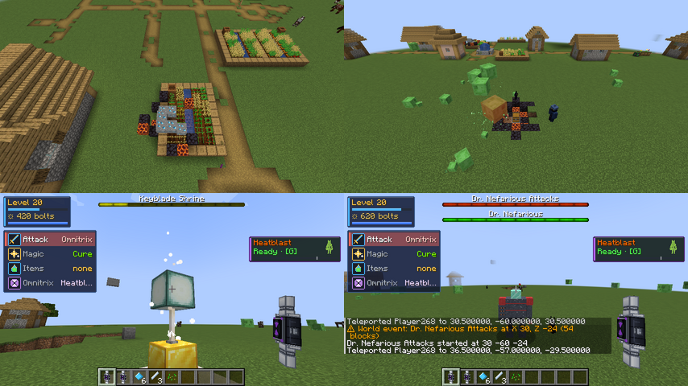

# Welt-Ereignisse (Dynamic World Events)

made by SANTIQ · Stand 2026-10-03 · AAA-Vorgabe „Dynamic World Events“

Seltene, angekündigte Ereignisse in der Oberwelt. Immer nur eines zugleich; Belohnung (Bolts, Helden-EP) für alle
Spieler, die in 64 Blöcken Umkreis dabei waren.

## Ablauf

- **Planung:** im Mittel alle `kingdomomnitrixWorldEventMinutes` Minuten (Standard 40, ±40 %), nur wenn ein Spieler
  im Überleben/Abenteuer lebt. Ein zufälliger Spieler bestimmt Heldenstufe und Ort: 40–70 Blöcke entfernt, trockener,
  geladener Boden, **keine Bauwerke** im 11 × 11-Umkreis (Dörfer, Spielerbauten, Felder bleiben verschont).
- **Ankündigung:** Chat an alle Spieler der Welt (Name, X/Z, Entfernung), Hinweis in der Aktionsleiste, Glocke;
  Bossleiste (Restzeit bzw. Fortschritt) für Spieler in 64 Blöcken.
- **Abschalten:** `/gamerule kingdomomnitrixWorldEvents false`. Auf „Friedlich“ nur der Meteor (alles andere lebt
  von Gegnern).
- **Befehle (OP):** `/hero event start [id]`, `/hero event stop`, `/hero event status`.

## Ereignisse (Datenpaket `data/<ns>/kingdomomnitrix/world_event/<id>.json`)

| Id | Typ | ab Stufe | Ablauf | Erfolg |
|---|---|---|---|---|
| `dark_rift` | dark_rift | 1 | Riss „Schattenschwarm“ öffnet sich | Riss geschlossen |
| `raritanium_meteor` | raritanium_meteor | 1 | Feuerschweif 3 s, Einschlag, Krater mit 5–8 Raritanium-Erz (12 % je Block Orichalcum) | nach dem Einschlag |
| `alien_crash` | alien_crash | 3 | Kapsel stürzt ab, Krater, Kiste (Raritanium, Mythril, zufällige DNA), 3–5 Herzlose als Wächter | Wächter besiegt |
| `keyblade_shrine` | keyblade_shrine | 5 | Schrein (Quarz, Gold, Endstab, Seelaterne); 60 s in 5 Blöcken halten, alle 8 s Herzlose | 60 s gehalten; Beute am Schrein, Schrein verschwindet |
| `heartless_invasion` | heartless_invasion | 8 | Riss „Invasion“: fünf Wellen | Riss geschlossen |
| `boss_nefarious` | boss_spawn | 20 | Dr. Nefarious landet | Boss besiegt |

Felder: `type`, `weight`, `min_level`, `duration_seconds` (Zeitlimit, danach ohne Belohnung vorbei), `dimensions`,
`rift` (Invasion/Riss), `rewards` (`bolts`, `experience`, `raritanium`, `mythril`, `orichalcum`, `dna`).
Prüfungen: `DataPackTest` (alle dekodieren, jeder Typ mindestens einmal, Riss-Ereignis ohne Riss abgelehnt),
`tools/check_assets.py` (Typ bekannt, Riss vorhanden, Name und Hinweis in de/en).

**Krater:** nur natürlicher Boden (Erde, Sand, Stein, Kies, Gras, Blumen; nicht Ackerboden/Pfade), Rand aus Magma und
Schwarzstein, nur wenn `mobGriefing` an ist. Krater und Erz bleiben (sie sind die Beute). Der Schrein wird beim Ende
(auch Abbruch und Server-Stopp) Block für Block zurückgesetzt. Bei Abbruch/Zeitablauf verschwinden Boss und Riss.

## Im Spiel geprüft (Einzelspieler, flache Welt mit Dörfern)

- Meteor: Schweif, Einschlag, Krater mit Raritanium-Erz, Magma, Schwarzstein, „geschafft“ nach dem Einschlag.
- Absturz: Krater bündig, Kiste mit 3 Raritanium, 2 Mythril, 1 DNA; Wächter da; nach dem Besiegen „geschafft“ (+150 Bolts, +200 EP).
- Schrein: Bau, Fortschritt in der Bossleiste, Herzlose greifen an, nach 60 s „geschafft“, Blöcke wieder Luft.
- Boss: Nefarious erscheint (Ereignis- und Boss-Leiste); Abbruch entfernt ihn.
- Invasion: Riss öffnet sich; Abbruch entfernt ihn.
- Planung: Abstand 5 min → nach Ablauf startete von selbst ein Schrein mit Ankündigung.

**Gefunden und behoben:**
- Ort lag in flachen Welten nie gültig (Mindesthöhe „Weltboden + 4“).
- Meteor traf ein Dorffeld → Bauwerks-Prüfung, Ackerboden/Pfade tabu.
- Kraterrand setzte Blöcke in die Luft.
- Abgebrochener Riss lief weiter.
- Auf „Friedlich“ galt der Absturz sofort als geschafft (Wächter verschwinden).
- Abbruch plante das nächste Ereignis nicht neu.

**Nicht geprüft:** Invasion und Boss bis zum Sieg (fünf Wellen bzw. Bosskampf), Mehrspieler-Beteiligung, Server-Stopp
während eines Schreins (Code setzt zurück, nicht im Spiel ausgelöst).

